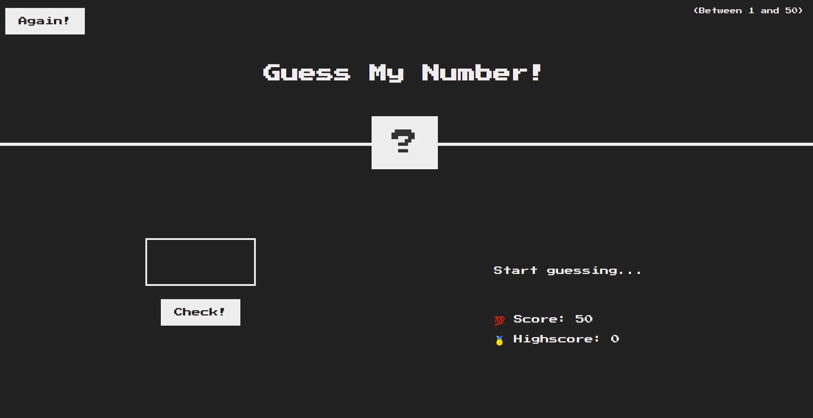

# TP_TestLogiciel
This is a simple flask application with Javascript. I implemented 3 types of testing : unit Tests, integreation Tests and e2e Tests

## Python Requirements 
To install needed requirements execute the command :  
``` 
pip install -r requirements.txt 
```

> :warning: **You need to have Python installed first**
## Unit Test
Commands : 

```
cd unitTest  
```
```
python3 -m pytest -vvv --cov=app test_app.py
```
## Integration Test
Commands :  
```
cd integration_test 
```
```
python3 -m pytest  --cov=app test.py
```
## E2E TEst
Commands:
```
cd e2eTest
```
Install cypress with NPM
```
npm install
```
Open Cypress :
``` 
node_modules/.bin/cypress open
```

