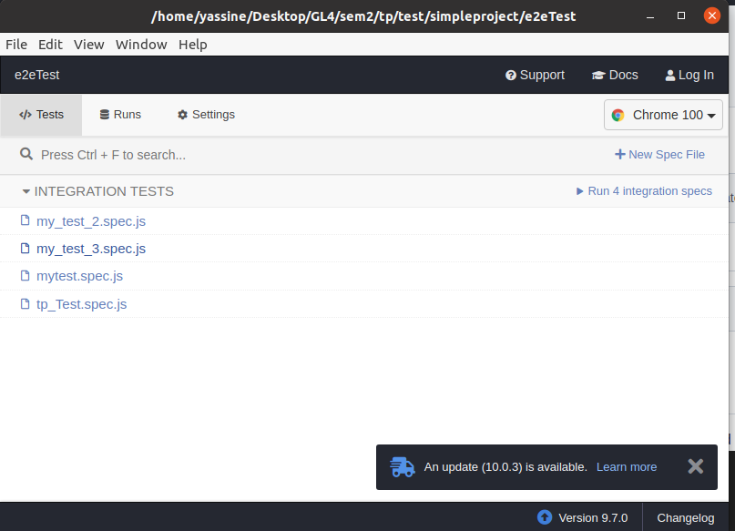

# End-to-End Testing using Cypress
I implemented some tests using **Cypress**
To open cypress :  
First : You have to be in the e2eTest directory  
Then install cypress with :
```
npm install
```
To open cypress run :
```
node_modules/.bin/cypress open
```


#### New Test :
- To add a new Test click on New Spec File and choose FileName
- Open the file created with a text editor and type your test code
- execute your Test in cypress

#### Examples : 
I recorded two examples:
- first_Test.gif
- Google_search.gif
